# Шаблон Use Case: разработка мини-проекта в Cursor

## Аннотация

Этот документ оформлен как публичный шаблон use case для разработки мини-проекта с помощью Cursor и других LLM-инструментов. Он показывает не только итоговый результат, но и сам процесс: как зафиксировать задачу, разбить её на этапы, ограничить контекст, подготовить понятные промпты и документировать решения так, чтобы другой разработчик мог быстро воспроизвести подход.

## Введение

Шаблон рассчитан на демонстрацию практики вайбкодинга в инженерном формате, а не на "магический" результат без контекста. Каждый этап оформлен одинаково:

1. Какие карточки используются.
2. Как выглядит промпт с пояснениями.
3. Какой блок можно сразу копировать в чат без комментариев.

Как использовать шаблон:

1. Замените плейсхолдеры вида `[описание проекта]`, `[список файлов]`, `[ограничения]` на данные своего кейса.
2. Для каждого этапа создавайте отдельный запрос или отдельную сессию, если контекст уже разросся.
3. После завершения этапа сохраняйте артефакт: ответ модели, принятое решение, diff, ссылку на PR или итоговый файл.
4. Если документ публикуется публично, оставляйте только полезные для читателя фрагменты: промпт, результат, краткий вывод и принятые ограничения.

## Основная часть

Ниже приведён шаблон последовательной работы с LLM над мини-проектом: от формализации задачи до фиксации результата.

## 1) Формализация задачи и требований {.prompt-page-break}
### 1. Карточки
Для написания промта будем использовать эти карточки:
<table>
  <tr>
    <td width="33%" valign="top">
      <a href="cards-screenshots/card01-role.pdf">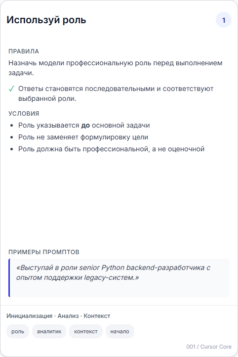</a><br>
      <a href="cards-screenshots/card01-role.pdf"><strong>01 - Используй роль</strong></a>
    </td>
    <td width="33%" valign="top">
      <a href="cards-screenshots/card02-goal.pdf">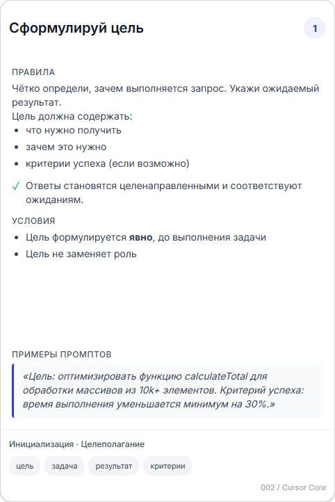</a><br>
      <a href="cards-screenshots/card02-goal.pdf"><strong>02 - Сформулируй цель</strong></a>
    </td>
    <td width="33%" valign="top">
      <a href="cards-screenshots/card03-detail-level.pdf">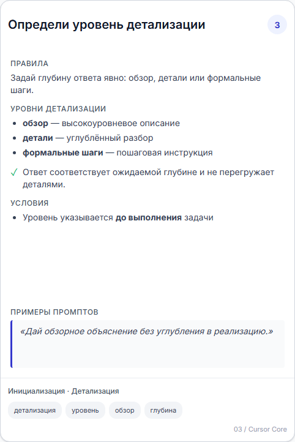</a><br>
      <a href="cards-screenshots/card03-detail-level.pdf"><strong>03 - Определи уровень детализации</strong></a>
    </td>
  </tr>
  <tr>
    <td width="33%" valign="top">
      <a href="cards-screenshots/card04-format-response.pdf">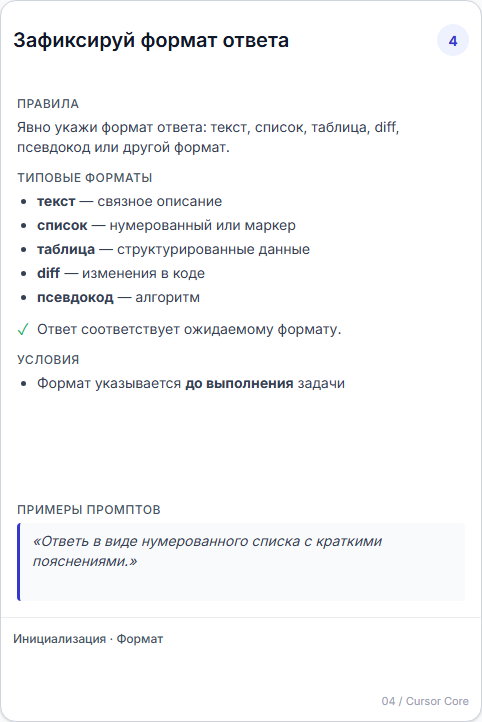</a><br>
      <a href="cards-screenshots/card04-format-response.pdf"><strong>04 - Зафиксируй формат ответа</strong></a>
    </td>
    <td width="33%" valign="top">
      <a href="cards-screenshots/card10-check-hypotheses.pdf">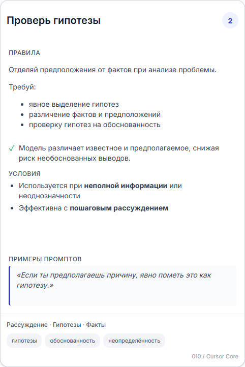</a><br>
      <a href="cards-screenshots/card10-check-hypotheses.pdf"><strong>10 - Проверь гипотезы</strong></a>
    </td>
    <td width="33%" valign="top">
      <a href="cards-screenshots/card12-explain-assumptions.pdf">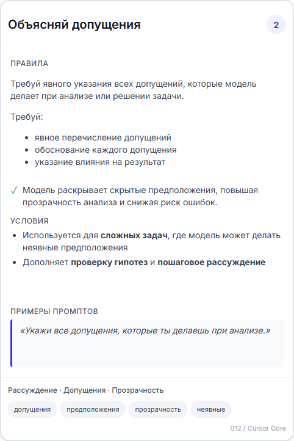</a><br>
      <a href="cards-screenshots/card12-explain-assumptions.pdf"><strong>12 - Объясняй допущения</strong></a>
    </td>
  </tr>
</table>

### 2. Текст промта
Роль: product-minded tech lead или senior engineer по домену проекта. (фиксируем роль [01](cards-screenshots/card01-role.pdf))
Цель: Превратить сырое описание задачи в понятную инженерную постановку. (фиксируем цель [02](cards-screenshots/card02-goal.pdf))
Уровень детализации: кратко, но достаточно для старта разработки. (уровень детализации [03](cards-screenshots/card03-detail-level.pdf))

Контекст:

- Исходное описание проекта: `[описание проекта от заказчика или автора]`
- Ограничения: `[платформа, язык, сроки, ограничения по инфраструктуре, важные запреты]`
- Домен: `[финтех / b2b / внутренний инструмент / cli / automation / ai workflow / ...]`

Нужно:

1. Сформулировать цель проекта.
2. Подготовить краткое описание проекта.
3. Выделить 5-8 ключевых задач.
4. Зафиксировать ограничения и критерии успеха.
5. Явно перечислить допущения и открытые вопросы, если данных не хватает. (гипотезы и допущения [10](cards-screenshots/card10-check-hypotheses.pdf), [12](cards-screenshots/card12-explain-assumptions.pdf))

Формат ответа: (фиксируем ожидаемую структуру ответа [04](cards-screenshots/card04-format-response.pdf))

1. Цель
2. Краткое описание
3. Ключевые задачи
4. Ограничения
5. Критерии успеха
6. Допущения / открытые вопросы

Ограничения ответа:

- Без кода.
- Без выбора библиотек, если это ещё рано.
- Не добавляй лишнюю теорию.
- Если есть спорные моменты, помечай их как допущения, а не как факты.

### 3. ПРОМТ без комментариев (для копирования)
```text
Роль: product-minded tech lead или senior engineer по домену проекта.
Цель: Превратить сырое описание задачи в понятную инженерную постановку.
Уровень детализации: кратко, но достаточно для старта разработки.

Контекст:
- Исходное описание проекта: [описание проекта от заказчика или автора]
- Ограничения: [платформа, язык, сроки, ограничения по инфраструктуре, важные запреты]
- Домен: [финтех / b2b / внутренний инструмент / cli / automation / ai workflow / ...]

Нужно:
1) Сформулировать цель проекта.
2) Подготовить краткое описание проекта.
3) Выделить 5-8 ключевых задач.
4) Зафиксировать ограничения и критерии успеха.
5) Явно перечислить допущения и открытые вопросы, если данных не хватает.

Формат ответа:
1) Цель
2) Краткое описание
3) Ключевые задачи
4) Ограничения
5) Критерии успеха
6) Допущения / открытые вопросы

Ограничения ответа:
- Без кода.
- Без выбора библиотек, если это ещё рано.
- Не добавляй лишнюю теорию.
- Если есть спорные моменты, помечай их как допущения, а не как факты.
```

---

## 2) Декомпозиция проекта на этапы {.prompt-page-break}
### 1. Карточки
Для написания промта будем использовать эти карточки:
<table>
  <tr>
    <td width="33%" valign="top">
      <a href="cards-screenshots/card02-goal.pdf"></a><br>
      <a href="cards-screenshots/card02-goal.pdf"><strong>02 - Сформулируй цель</strong></a>
    </td>
    <td width="33%" valign="top">
      <a href="cards-screenshots/card03-detail-level.pdf"></a><br>
      <a href="cards-screenshots/card03-detail-level.pdf"><strong>03 - Определи уровень детализации</strong></a>
    </td>
    <td width="33%" valign="top">
      <a href="cards-screenshots/card04-format-response.pdf"></a><br>
      <a href="cards-screenshots/card04-format-response.pdf"><strong>04 - Зафиксируй формат ответа</strong></a>
    </td>
  </tr>
  <tr>
    <td width="33%" valign="top">
      <a href="cards-screenshots/card06-limit-scope.pdf">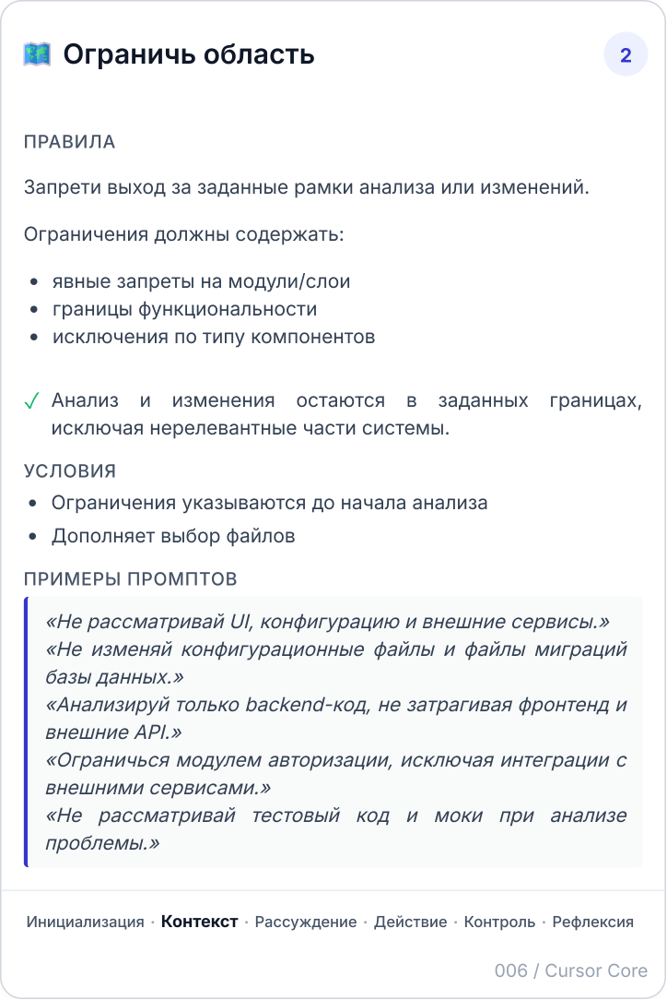</a><br>
      <a href="cards-screenshots/card06-limit-scope.pdf"><strong>06 - Ограничь область</strong></a>
    </td>
    <td width="33%" valign="top">
      <a href="cards-screenshots/card25-suggest-next-step.pdf">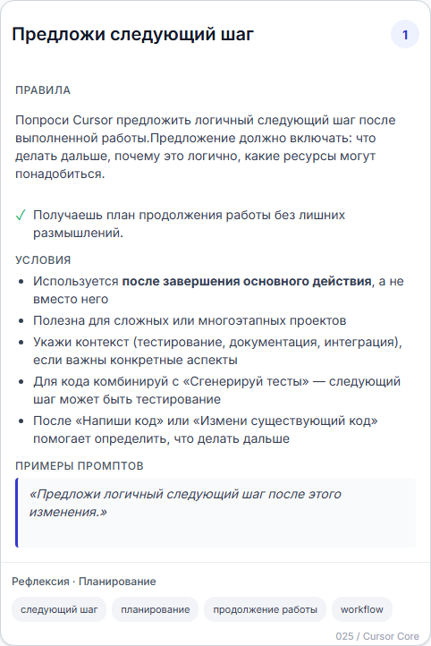</a><br>
      <a href="cards-screenshots/card25-suggest-next-step.pdf"><strong>25 - Предложи следующий шаг</strong></a>
    </td>
    <td width="33%" valign="top">
    </td>
  </tr>
</table>

### 2. Текст промта
Цель: Разбить проект на крупные инженерные этапы так, чтобы по ним можно было вести отдельные сессии в Cursor. (цель [02](cards-screenshots/card02-goal.pdf))
Уровень детализации: обзорный план, без кода. (детализация [03](cards-screenshots/card03-detail-level.pdf))

Контекст:

- Описание проекта: `[сжатое описание из этапа 1]`
- Ограничения: `[ключевые ограничения]`
- Формат разработки: `[один исполнитель / команда / pet project / публичное demo]`

Нужно:

1. Разбить проект на 5-8 этапов.
2. Для каждого этапа указать цель, результат и зависимость от предыдущих шагов.
3. Отдельно отметить, какие этапы стоит делать в новой сессии.
4. В конце предложить ближайший следующий шаг. (следующий шаг [25](cards-screenshots/card25-suggest-next-step.pdf))

Формат ответа: (фиксируем формат плана [04](cards-screenshots/card04-format-response.pdf))

1. Название этапа
2. Цель этапа
3. Ожидаемый артефакт
4. Что должно быть готово до начала
5. Стоит ли открывать новую сессию

Ограничения ответа: (сужаем область до полезного для планирования [06](cards-screenshots/card06-limit-scope.pdf))

- Без реализации.
- Без повторения полного описания проекта.
- Не дроби работу слишком мелко.
- Не предлагай этапы, не влияющие на результат demo.

### 3. ПРОМТ без комментариев (для копирования)
```text
Цель: Разбить проект на крупные инженерные этапы так, чтобы по ним можно было вести отдельные сессии в Cursor.
Уровень детализации: обзорный план, без кода.

Контекст:
- Описание проекта: [сжатое описание из этапа 1]
- Ограничения: [ключевые ограничения]
- Формат разработки: [один исполнитель / команда / pet project / публичное demo]

Нужно:
1) Разбить проект на 5-8 этапов.
2) Для каждого этапа указать цель, результат и зависимость от предыдущих шагов.
3) Отдельно отметить, какие этапы стоит делать в новой сессии.
4) В конце предложить ближайший следующий шаг.

Формат ответа:
1) Название этапа
2) Цель этапа
3) Ожидаемый артефакт
4) Что должно быть готово до начала
5) Стоит ли открывать новую сессию

Ограничения ответа:
- Без реализации.
- Без повторения полного описания проекта.
- Не дроби работу слишком мелко.
- Не предлагай этапы, не влияющие на результат demo.
```

---

## 3) Архитектура, структура и именование {.prompt-page-break}
### 1. Карточки
Для написания промта будем использовать эти карточки:
<table>
  <tr>
    <td width="33%" valign="top">
      <a href="cards-screenshots/card02-goal.pdf"></a><br>
      <a href="cards-screenshots/card02-goal.pdf"><strong>02 - Сформулируй цель</strong></a>
    </td>
    <td width="33%" valign="top">
      <a href="cards-screenshots/card03-detail-level.pdf"></a><br>
      <a href="cards-screenshots/card03-detail-level.pdf"><strong>03 - Определи уровень детализации</strong></a>
    </td>
    <td width="33%" valign="top">
      <a href="cards-screenshots/card04-format-response.pdf"></a><br>
      <a href="cards-screenshots/card04-format-response.pdf"><strong>04 - Зафиксируй формат ответа</strong></a>
    </td>
  </tr>
  <tr>
    <td width="33%" valign="top">
      <a href="cards-screenshots/card06-limit-scope.pdf"></a><br>
      <a href="cards-screenshots/card06-limit-scope.pdf"><strong>06 - Ограничь область</strong></a>
    </td>
    <td width="33%" valign="top">
      <a href="cards-screenshots/card15-suggest-solution.pdf">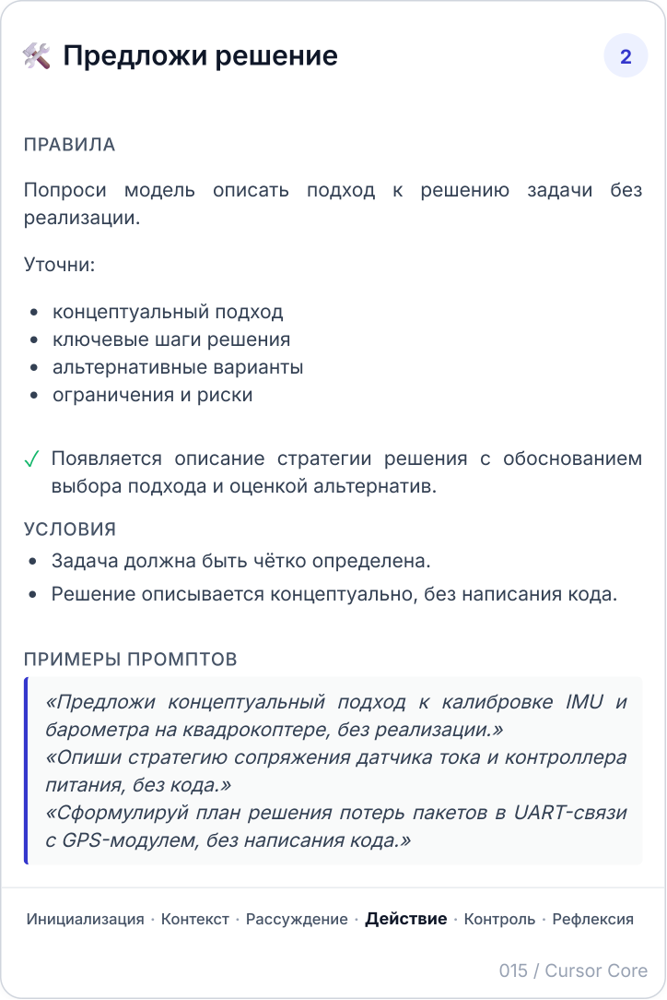</a><br>
      <a href="cards-screenshots/card15-suggest-solution.pdf"><strong>15 - Предложи решение</strong></a>
    </td>
    <td width="33%" valign="top">
      <a href="cards-screenshots/card22-forbid-guessing.pdf">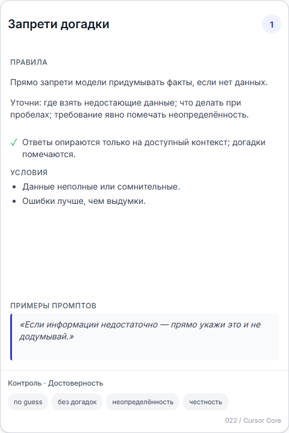</a><br>
      <a href="cards-screenshots/card22-forbid-guessing.pdf"><strong>22 - Запрети угадывание</strong></a>
    </td>
  </tr>
</table>

### 2. Текст промта
Цель: Определить структуру проекта, названия модулей и границы ответственности до начала кодинга. (цель [02](cards-screenshots/card02-goal.pdf))
Уровень детализации: средний, без реализации функций. (детализация [03](cards-screenshots/card03-detail-level.pdf))

Контекст:

- Тип проекта: `[cli / web / daemon / plugin / script / service / ai workflow]`
- Язык / стек: `[python / typescript / go / ...]`
- Основные сценарии: `[список 3-5 ключевых сценариев]`
- Ограничения: `[монорепо / минимум файлов / no framework / no db / ...]`

Нужно:

1. Предложить структуру папок и файлов. (ожидаем проектное предложение от модели [15](cards-screenshots/card15-suggest-solution.pdf))
2. Дать названия основным модулям, классам или сервисам.
3. Кратко описать ответственность каждого файла.
4. Отдельно указать entry point, конфигурацию, тесты и документацию.
5. Если данных недостаточно, явно напиши, чего не хватает, вместо угадывания. (запрет угадывания [22](cards-screenshots/card22-forbid-guessing.pdf))

Формат ответа: (фиксируем структуру результата [04](cards-screenshots/card04-format-response.pdf))

1. Название проекта
2. Структура репозитория
3. Таблица: файл -> назначение
4. Список спорных мест / вопросов

Ограничения ответа: (сужаем ответ до архитектуры и именования [06](cards-screenshots/card06-limit-scope.pdf))

- Без кода.
- Не перечисляй лишние файлы "на всякий случай".
- Не описывай внутреннюю реализацию алгоритмов.
- Предлагай структуру, которую реально удобно показать публично.

### 3. ПРОМТ без комментариев (для копирования)
```text
Цель: Определить структуру проекта, названия модулей и границы ответственности до начала кодинга.
Уровень детализации: средний, без реализации функций.

Контекст:
- Тип проекта: [cli / web / daemon / plugin / script / service / ai workflow]
- Язык / стек: [python / typescript / go / ...]
- Основные сценарии: [список 3-5 ключевых сценариев]
- Ограничения: [монорепо / минимум файлов / no framework / no db / ...]

Нужно:
1) Предложить структуру папок и файлов.
2) Дать названия основным модулям, классам или сервисам.
3) Кратко описать ответственность каждого файла.
4) Отдельно указать entry point, конфигурацию, тесты и документацию.
5) Если данных недостаточно, явно напиши, чего не хватает, вместо угадывания.

Формат ответа:
1) Название проекта
2) Структура репозитория
3) Таблица: файл -> назначение
4) Список спорных мест / вопросов

Ограничения ответа:
- Без кода.
- Не перечисляй лишние файлы "на всякий случай".
- Не описывай внутреннюю реализацию алгоритмов.
- Предлагай структуру, которую реально удобно показать публично.
```

---

## 4) Исследование сложного этапа и выбор варианта {.prompt-page-break}
### 1. Карточки
Для написания промта будем использовать эти карточки:
<table>
  <tr>
    <td width="33%" valign="top">
      <a href="cards-screenshots/card10-check-hypotheses.pdf"></a><br>
      <a href="cards-screenshots/card10-check-hypotheses.pdf"><strong>10 - Проверь гипотезы</strong></a>
    </td>
    <td width="33%" valign="top">
      <a href="cards-screenshots/card11-compare-alternatives.pdf">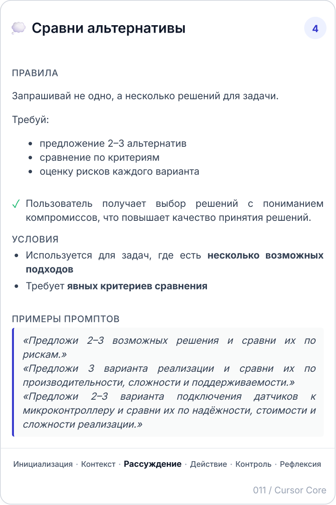</a><br>
      <a href="cards-screenshots/card11-compare-alternatives.pdf"><strong>11 - Сравни альтернативы</strong></a>
    </td>
    <td width="33%" valign="top">
      <a href="cards-screenshots/card12-explain-assumptions.pdf"></a><br>
      <a href="cards-screenshots/card12-explain-assumptions.pdf"><strong>12 - Объясняй допущения</strong></a>
    </td>
  </tr>
  <tr>
    <td width="33%" valign="top">
      <a href="cards-screenshots/card24-assess-risks.pdf">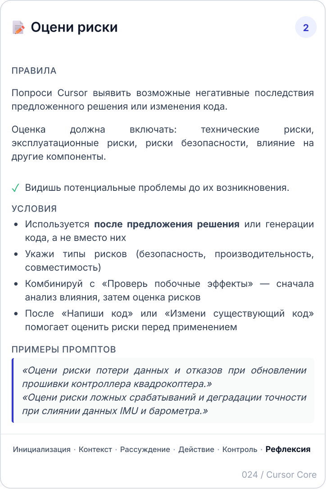</a><br>
      <a href="cards-screenshots/card24-assess-risks.pdf"><strong>24 - Оцени риски</strong></a>
    </td>
    <td width="33%" valign="top">
      <a href="cards-screenshots/card15-suggest-solution.pdf"></a><br>
      <a href="cards-screenshots/card15-suggest-solution.pdf"><strong>15 - Предложи решение</strong></a>
    </td>
    <td width="33%" valign="top">
    </td>
  </tr>
</table>

### 2. Текст промта
Цель: Перед реализацией сложного этапа сравнить несколько решений и выбрать одно на основании рисков и допущений. (фокус на сравнении вариантов [11](cards-screenshots/card11-compare-alternatives.pdf))

Контекст:

- Этап: `[название сложного этапа]`
- Проблема: `[что именно нужно решить]`
- Ограничения: `[производительность / UX / совместимость / sandbox / offline / ...]`
- Допустимые варианты: `[если уже есть 2-3 идеи, перечислить]`

Нужно:

1. Предложить 2-4 реалистичных варианта решения. (варианты решения [15](cards-screenshots/card15-suggest-solution.pdf))
2. Для каждого варианта указать плюсы, минусы, риски и скрытые допущения. (гипотезы и допущения [10](cards-screenshots/card10-check-hypotheses.pdf), [12](cards-screenshots/card12-explain-assumptions.pdf))
3. Отдельно отметить, какой вариант лучше подходит для demo / public repo.
4. В конце дать одну рекомендацию и объяснить выбор.

Формат ответа:

1. Вариант
2. Плюсы
3. Минусы
4. Риски (оценка рисков [24](cards-screenshots/card24-assess-risks.pdf))
5. Допущения
6. Рекомендация

Ограничения ответа:

- Без кода.
- Не предлагай экзотические решения без явной причины.
- Если лучший вариант зависит от непроверенного факта, пометь это отдельно.

### 3. ПРОМТ без комментариев (для копирования)
```text
Цель: Перед реализацией сложного этапа сравнить несколько решений и выбрать одно на основании рисков и допущений.

Контекст:
- Этап: [название сложного этапа]
- Проблема: [что именно нужно решить]
- Ограничения: [производительность / UX / совместимость / sandbox / offline / ...]
- Допустимые варианты: [если уже есть 2-3 идеи, перечислить]

Нужно:
1) Предложить 2-4 реалистичных варианта решения.
2) Для каждого варианта указать плюсы, минусы, риски и скрытые допущения.
3) Отдельно отметить, какой вариант лучше подходит для demo / public repo.
4) В конце дать одну рекомендацию и объяснить выбор.

Формат ответа:
1) Вариант
2) Плюсы
3) Минусы
4) Риски
5) Допущения
6) Рекомендация

Ограничения ответа:
- Без кода.
- Не предлагай экзотические решения без явной причины.
- Если лучший вариант зависит от непроверенного факта, пометь это отдельно.
```

---

## 5) Реализация отдельного этапа {.prompt-page-break}
### 1. Карточки
Для написания промта будем использовать эти карточки:
<table>
  <tr>
    <td width="33%" valign="top">
      <a href="cards-screenshots/card05-select-files.pdf">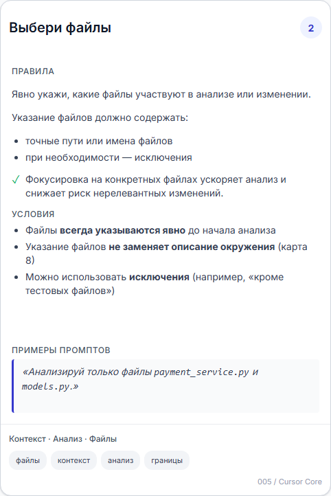</a><br>
      <a href="cards-screenshots/card05-select-files.pdf"><strong>05 - Выбери файлы</strong></a>
    </td>
    <td width="33%" valign="top">
      <a href="cards-screenshots/card06-limit-scope.pdf"></a><br>
      <a href="cards-screenshots/card06-limit-scope.pdf"><strong>06 - Ограничь область</strong></a>
    </td>
    <td width="33%" valign="top">
      <a href="cards-screenshots/card16-write-code.pdf">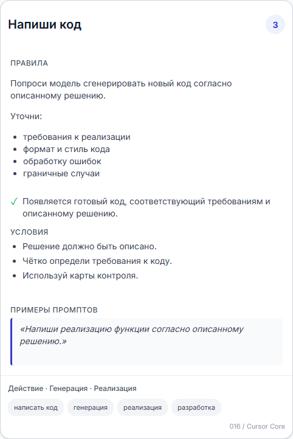</a><br>
      <a href="cards-screenshots/card16-write-code.pdf"><strong>16 - Напиши код</strong></a>
    </td>
  </tr>
  <tr>
    <td width="33%" valign="top">
      <a href="cards-screenshots/card19-request-diff.pdf">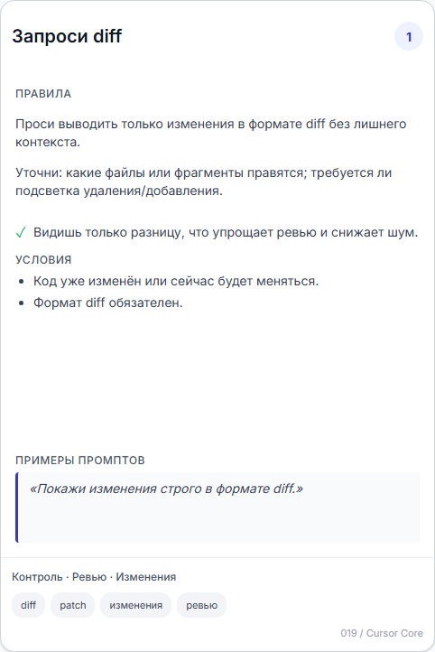</a><br>
      <a href="cards-screenshots/card19-request-diff.pdf"><strong>19 - Запроси diff</strong></a>
    </td>
    <td width="33%" valign="top">
      <a href="cards-screenshots/card20-limit-changes.pdf">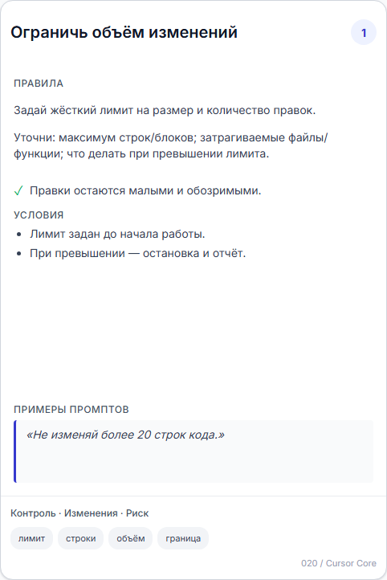</a><br>
      <a href="cards-screenshots/card20-limit-changes.pdf"><strong>20 - Ограничь изменения</strong></a>
    </td>
    <td width="33%" valign="top">
      <a href="cards-screenshots/card21-check-side-effects.pdf">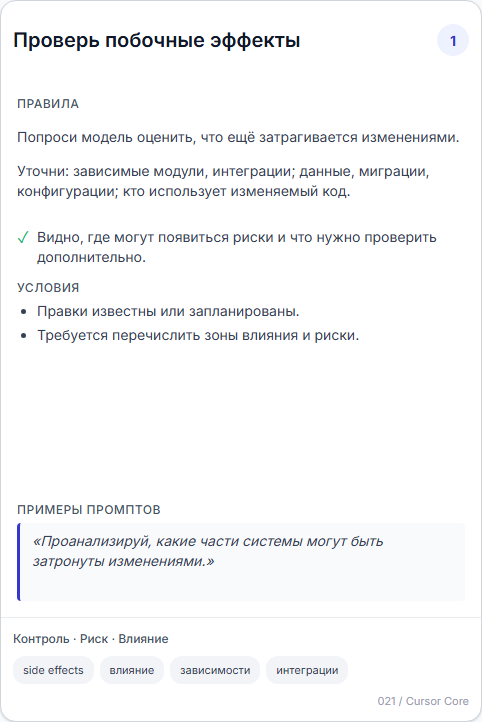</a><br>
      <a href="cards-screenshots/card21-check-side-effects.pdf"><strong>21 - Проверь побочные эффекты</strong></a>
    </td>
  </tr>
</table>

### 2. Текст промта
Цель: Реализовать один конкретный этап без расползания в соседние части проекта. (держим задачу в узких границах [06](cards-screenshots/card06-limit-scope.pdf))

Контекст:

- Этап: `[название этапа]`
- Задача: `[что нужно реализовать]`
- Файлы: `[список файлов, которые можно менять]` (заранее выбираем область изменений [05](cards-screenshots/card05-select-files.pdf))
- Не трогать: `[список файлов / частей системы, которые нельзя менять]`
- Ограничения: `[без рефакторинга / без новых зависимостей / только bugfix / только diff / ...]`

Нужно:

1. Внести только необходимые изменения.
2. Кратко проверить, не ломают ли они соседние части. (проверка побочных эффектов [21](cards-screenshots/card21-check-side-effects.pdf))
3. Вернуть только diff или очень короткое summary + diff, если это важно. (diff [19](cards-screenshots/card19-request-diff.pdf))

Формат ответа:

1. Изменённые файлы
2. Unified diff
3. Риски / что проверить вручную

Ограничения ответа:

- Не переписывай весь файл, если достаточно локального изменения.
- Не меняй архитектуру этапа без прямого запроса. (ограничение масштаба изменений [20](cards-screenshots/card20-limit-changes.pdf))
- Не добавляй новые файлы без необходимости.
- Перед изменением проверь побочные эффекты на затронутые сценарии. (side effects [21](cards-screenshots/card21-check-side-effects.pdf))
- Если нужен код, показывай именно реализацию, а не только рассуждения. (переход к кодированию [16](cards-screenshots/card16-write-code.pdf))

### 3. ПРОМТ без комментариев (для копирования)
```text
Цель: Реализовать один конкретный этап без расползания в соседние части проекта.

Контекст:
- Этап: [название этапа]
- Задача: [что нужно реализовать]
- Файлы: [список файлов, которые можно менять]
- Не трогать: [список файлов / частей системы, которые нельзя менять]
- Ограничения: [без рефакторинга / без новых зависимостей / только bugfix / только diff / ...]

Нужно:
1) Внести только необходимые изменения.
2) Кратко проверить, не ломают ли они соседние части.
3) Вернуть только diff или очень короткое summary + diff, если это важно.

Формат ответа:
1) Изменённые файлы
2) Unified diff
3) Риски / что проверить вручную

Ограничения ответа:
- Не переписывай весь файл, если достаточно локального изменения.
- Не меняй архитектуру этапа без прямого запроса.
- Не добавляй новые файлы без необходимости.
- Перед изменением проверь побочные эффекты на затронутые сценарии.
```

---

## 6) Проверка проблем и точечные правки {.prompt-page-break}
### 1. Карточки
Для написания промта будем использовать эти карточки:
<table>
  <tr>
    <td width="33%" valign="top">
      <a href="cards-screenshots/card14-find-problem.pdf">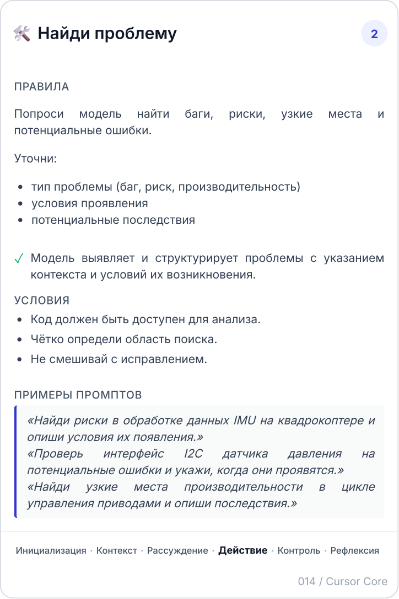</a><br>
      <a href="cards-screenshots/card14-find-problem.pdf"><strong>14 - Найди проблему</strong></a>
    </td>
    <td width="33%" valign="top">
      <a href="cards-screenshots/card17-modify-code.pdf">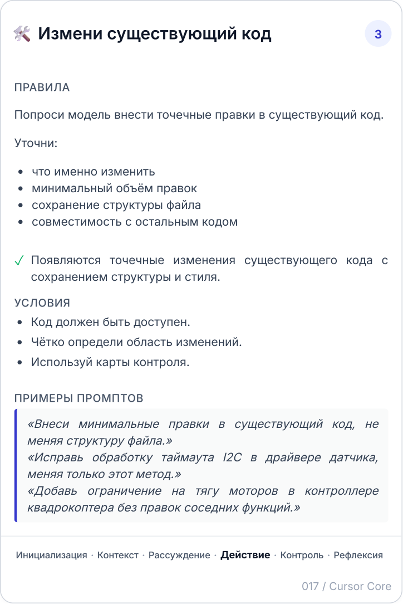</a><br>
      <a href="cards-screenshots/card17-modify-code.pdf"><strong>17 - Измени код</strong></a>
    </td>
    <td width="33%" valign="top">
      <a href="cards-screenshots/card20-limit-changes.pdf"></a><br>
      <a href="cards-screenshots/card20-limit-changes.pdf"><strong>20 - Ограничь изменения</strong></a>
    </td>
  </tr>
  <tr>
    <td width="33%" valign="top">
      <a href="cards-screenshots/card21-check-side-effects.pdf"></a><br>
      <a href="cards-screenshots/card21-check-side-effects.pdf"><strong>21 - Проверь побочные эффекты</strong></a>
    </td>
    <td width="33%" valign="top">
      <a href="cards-screenshots/card23-self-check.pdf">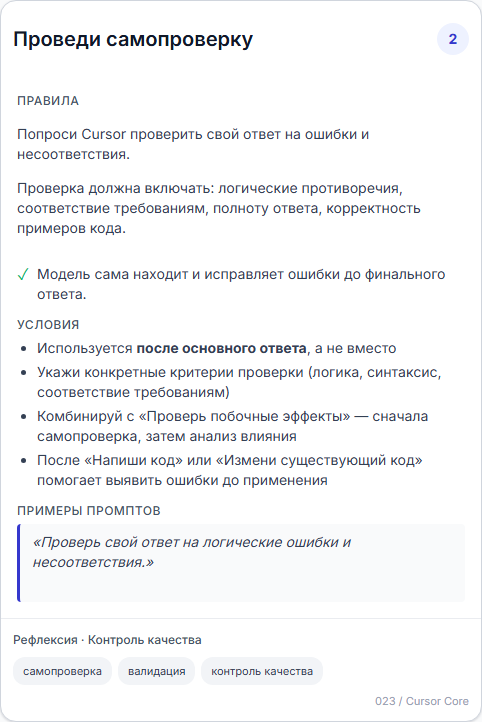</a><br>
      <a href="cards-screenshots/card23-self-check.pdf"><strong>23 - Самопроверка</strong></a>
    </td>
    <td width="33%" valign="top">
    </td>
  </tr>
</table>

### 2. Текст промта
Цель: Найти слабые места в уже предложенном решении и исправить только подтверждённые проблемы. (поиск проблем [14](cards-screenshots/card14-find-problem.pdf))

Контекст:

- Изменённые файлы: `[список файлов]`
- Новый функционал: `[что недавно было добавлено]`
- Ожидаемое поведение: `[коротко]`
- Ограничения: `[не трогать интерфейс / не менять контракт / не трогать unrelated code / ...]`

Нужно:

1. Провести короткий review текущего решения.
2. Найти реальные риски, баги или несоответствия.
3. Если проблемы есть, предложить минимальный фикс. (точечное изменение кода [17](cards-screenshots/card17-modify-code.pdf))
4. Перед финальным ответом сделать самопроверку, что исправление не расширило область изменений без необходимости. (самопроверка [23](cards-screenshots/card23-self-check.pdf))

Формат ответа:

1. Найденные проблемы
2. Причина
3. Минимальное исправление
4. Что проверить после фикса

Ограничения ответа:

- Не придумывай проблемы без признаков в коде или требованиях.
- Если проблем нет, так и напиши.
- Если предлагаешь фикс, он должен быть минимальным по охвату. (ограничение масштаба изменений [20](cards-screenshots/card20-limit-changes.pdf))
- После фикса отдельно проверь, не задел ли он соседние сценарии. (проверка побочных эффектов [21](cards-screenshots/card21-check-side-effects.pdf))

### 3. ПРОМТ без комментариев (для копирования)
```text
Цель: Найти слабые места в уже предложенном решении и исправить только подтверждённые проблемы.

Контекст:
- Изменённые файлы: [список файлов]
- Новый функционал: [что недавно было добавлено]
- Ожидаемое поведение: [коротко]
- Ограничения: [не трогать интерфейс / не менять контракт / не трогать unrelated code / ...]

Нужно:
1) Провести короткий review текущего решения.
2) Найти реальные риски, баги или несоответствия.
3) Если проблемы есть, предложить минимальный фикс.
4) Перед финальным ответом сделать самопроверку, что исправление не расширило область изменений без необходимости.

Формат ответа:
1) Найденные проблемы
2) Причина
3) Минимальное исправление
4) Что проверить после фикса

Ограничения ответа:
- Не придумывай проблемы без признаков в коде или требованиях.
- Если проблем нет, так и напиши.
- Если предлагаешь фикс, он должен быть минимальным по охвату.
```

---

## 7) Тестирование и проверка побочных эффектов {.prompt-page-break}
### 1. Карточки
Для написания промта будем использовать эти карточки:
<table>
  <tr>
    <td width="33%" valign="top">
      <a href="cards-screenshots/card05-select-files.pdf"></a><br>
      <a href="cards-screenshots/card05-select-files.pdf"><strong>05 - Выбери файлы</strong></a>
    </td>
    <td width="33%" valign="top">
      <a href="cards-screenshots/card06-limit-scope.pdf"></a><br>
      <a href="cards-screenshots/card06-limit-scope.pdf"><strong>06 - Ограничь область</strong></a>
    </td>
    <td width="33%" valign="top">
      <a href="cards-screenshots/card18-generate-tests.pdf">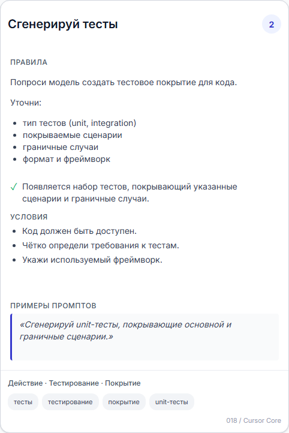</a><br>
      <a href="cards-screenshots/card18-generate-tests.pdf"><strong>18 - Сгенерируй тесты</strong></a>
    </td>
  </tr>
  <tr>
    <td width="33%" valign="top">
      <a href="cards-screenshots/card21-check-side-effects.pdf"></a><br>
      <a href="cards-screenshots/card21-check-side-effects.pdf"><strong>21 - Проверь побочные эффекты</strong></a>
    </td>
    <td width="33%" valign="top">
      <a href="cards-screenshots/card23-self-check.pdf"></a><br>
      <a href="cards-screenshots/card23-self-check.pdf"><strong>23 - Самопроверка</strong></a>
    </td>
    <td width="33%" valign="top">
    </td>
  </tr>
</table>

### 2. Текст промта
Цель: Добавить тесты и проверить, что новый этап не сломал соседнее поведение. (фокусируемся на тестовом контуре [18](cards-screenshots/card18-generate-tests.pdf))

Контекст:

- Production-файлы: `[список production файлов]`
- Тестовые файлы: `[список тестовых файлов]` (явно выбираем, какие тесты и модули участвуют [05](cards-screenshots/card05-select-files.pdf))
- Новый функционал: `[что именно появилось]`
- Риски: `[что особенно важно не сломать]`

Нужно:

1. Предложить или написать минимально достаточный набор тестов.
2. Покрыть позитивные, негативные и граничные сценарии.
3. Отдельно указать побочные эффекты, которые стоит проверить вручную. (проверка побочных эффектов [21](cards-screenshots/card21-check-side-effects.pdf))
4. Если тесты не нужны или их некуда добавлять, объяснить почему. (самопроверка на уместность запроса [23](cards-screenshots/card23-self-check.pdf))

Формат ответа:

1. Какие кейсы покрываем
2. Какие файлы тестов меняем
3. Diff или preview новых тестов
4. Что проверить руками

Ограничения ответа: (сужаем область до тестов и верификации [06](cards-screenshots/card06-limit-scope.pdf))

- Не меняй production-код, если запрос только на тесты.
- Не дублируй уже существующие кейсы без необходимости.
- Фокус на реальных сценариях использования, а не на искусственном покрытии строк.

### 3. ПРОМТ без комментариев (для копирования)
```text
Цель: Добавить тесты и проверить, что новый этап не сломал соседнее поведение.

Контекст:
- Production-файлы: [список production файлов]
- Тестовые файлы: [список тестовых файлов]
- Новый функционал: [что именно появилось]
- Риски: [что особенно важно не сломать]

Нужно:
1) Предложить или написать минимально достаточный набор тестов.
2) Покрыть позитивные, негативные и граничные сценарии.
3) Отдельно указать побочные эффекты, которые стоит проверить вручную.
4) Если тесты не нужны или их некуда добавлять, объяснить почему.

Формат ответа:
1) Какие кейсы покрываем
2) Какие файлы тестов меняем
3) Diff или preview новых тестов
4) Что проверить руками

Ограничения ответа:
- Не меняй production-код, если запрос только на тесты.
- Не дублируй уже существующие кейсы без необходимости.
- Фокус на реальных сценариях использования, а не на искусственном покрытии строк.
```

---

## 8) Итоговая фиксация результата для публикации {.prompt-page-break}
### 1. Карточки
Для написания промта будем использовать эти карточки:
<table>
  <tr>
    <td width="33%" valign="top">
      <a href="cards-screenshots/card04-format-response.pdf"></a><br>
      <a href="cards-screenshots/card04-format-response.pdf"><strong>04 - Зафиксируй формат ответа</strong></a>
    </td>
    <td width="33%" valign="top">
      <a href="cards-screenshots/card23-self-check.pdf"></a><br>
      <a href="cards-screenshots/card23-self-check.pdf"><strong>23 - Самопроверка</strong></a>
    </td>
    <td width="33%" valign="top">
      <a href="cards-screenshots/card25-suggest-next-step.pdf"></a><br>
      <a href="cards-screenshots/card25-suggest-next-step.pdf"><strong>25 - Предложи следующий шаг</strong></a>
    </td>
  </tr>
  <tr>
    <td width="33%" valign="top">
      <a href="cards-screenshots/card26-summarize-result.pdf">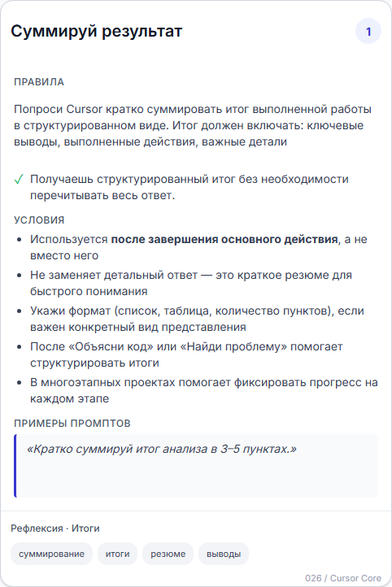</a><br>
      <a href="cards-screenshots/card26-summarize-result.pdf"><strong>26 - Подведи итог</strong></a>
    </td>
    <td width="33%" valign="top">
      <a href="cards-screenshots/card24-assess-risks.pdf"></a><br>
      <a href="cards-screenshots/card24-assess-risks.pdf"><strong>24 - Оцени риски</strong></a>
    </td>
    <td width="33%" valign="top">
    </td>
  </tr>
</table>

### 2. Текст промта
Цель: Подготовить краткий публичный итог по этапу или по всему mini-project use case. (задача на итоговое резюме [26](cards-screenshots/card26-summarize-result.pdf))

Контекст:

- Что было сделано: `[список изменений]`
- Какие файлы затронуты: `[список файлов]`
- Какие проверки выполнены: `[тесты / ручные проверки / smoke]`
- Что не сделано: `[если есть ограничения]`

Нужно:

1. Кратко зафиксировать результат.
2. Перечислить проверенные сценарии.
3. Указать оставшиеся риски и ограничения. (оценка рисков [24](cards-screenshots/card24-assess-risks.pdf))
4. Предложить следующий шаг для развития проекта или документации. (следующий шаг [25](cards-screenshots/card25-suggest-next-step.pdf))

Формат ответа: (фиксируем финальную структуру summary [04](cards-screenshots/card04-format-response.pdf))

1. Что сделано
2. Что проверено
3. Ограничения / риски
4. Следующий шаг

Ограничения ответа:

- Без длинного пересказа всей истории.
- Пиши так, чтобы этот блок можно было вставить в README, issue, PR или demo-описание.
- Перед финальной формулировкой проверь, что summary не разросся и не потерял главное. (самопроверка [23](cards-screenshots/card23-self-check.pdf))

### 3. ПРОМТ без комментариев (для копирования)
```text
Цель: Подготовить краткий публичный итог по этапу или по всему mini-project use case.

Контекст:
- Что было сделано: [список изменений]
- Какие файлы затронуты: [список файлов]
- Какие проверки выполнены: [тесты / ручные проверки / smoke]
- Что не сделано: [если есть ограничения]

Нужно:
1) Кратко зафиксировать результат.
2) Перечислить проверенные сценарии.
3) Указать оставшиеся риски и ограничения.
4) Предложить следующий шаг для развития проекта или документации.

Формат ответа:
1) Что сделано
2) Что проверено
3) Ограничения / риски
4) Следующий шаг

Ограничения ответа:
- Без длинного пересказа всей истории.
- Пиши так, чтобы этот блок можно было вставить в README, issue, PR или demo-описание.
```

---

## Заключение

Этот шаблон лучше подходит для публичной публикации, чем линейный "лог чата", потому что показывает разработчику воспроизводимый процесс: какие карточки применялись, зачем был нужен конкретный промпт, какой формат ответа ожидается и как фиксировать результат после каждого этапа. В таком виде документ можно использовать и как инструкцию, и как демонстрационный use case для команды.

Если нужно оформить реальный кейс, поверх этого шаблона обычно достаточно добавить:

1. Короткое описание проекта и ссылки на репозиторий.
2. 1-2 реальных примера ответов модели вместо всех ответов подряд.
3. Финальный summary с выводами, тестами и принятыми инженерными решениями.

---

## Каталог карточек (3 в строке)

> В каталоге ниже собраны карточки, на которые ссылается шаблон. Их можно использовать как справочник при подготовке собственных промптов и публичных кейсов.

<table>
  <tr>
    <td width="33%" valign="top">
      <a href="cards-screenshots/card01-role.pdf"></a><br>
      <strong><a href="cards-screenshots/card01-role.pdf">01 - Используй роль</a></strong>
    </td>
    <td width="33%" valign="top">
      <a href="cards-screenshots/card02-goal.pdf"></a><br>
      <strong><a href="cards-screenshots/card02-goal.pdf">02 - Сформулируй цель</a></strong>
    </td>
    <td width="33%" valign="top">
      <a href="cards-screenshots/card03-detail-level.pdf"></a><br>
      <strong><a href="cards-screenshots/card03-detail-level.pdf">03 - Определи уровень детализации</a></strong>
    </td>
  </tr>
  <tr>
    <td width="33%" valign="top">
      <a href="cards-screenshots/card04-format-response.pdf"></a><br>
      <strong><a href="cards-screenshots/card04-format-response.pdf">04 - Зафиксируй формат ответа</a></strong>
    </td>
    <td width="33%" valign="top">
      <a href="cards-screenshots/card05-select-files.pdf"></a><br>
      <strong><a href="cards-screenshots/card05-select-files.pdf">05 - Выбери файлы</a></strong>
    </td>
    <td width="33%" valign="top">
      <a href="cards-screenshots/card06-limit-scope.pdf"></a><br>
      <strong><a href="cards-screenshots/card06-limit-scope.pdf">06 - Ограничь область</a></strong>
    </td>
  </tr>
  <tr>
    <td width="33%" valign="top">
      <a href="cards-screenshots/card07-entry-point.pdf">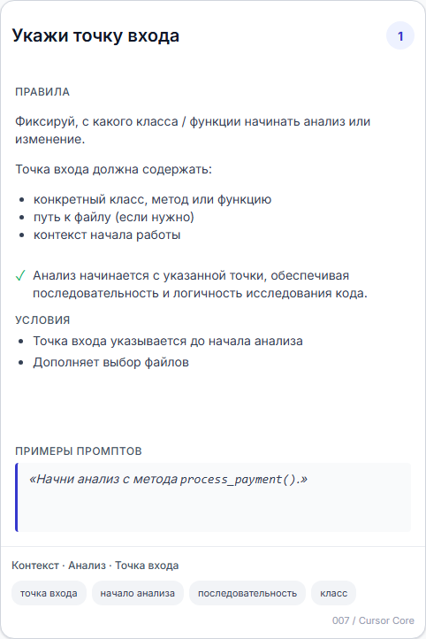</a><br>
      <strong><a href="cards-screenshots/card07-entry-point.pdf">07 - Укажи entry point</a></strong>
    </td>
    <td width="33%" valign="top">
      <a href="cards-screenshots/card08-environment.pdf">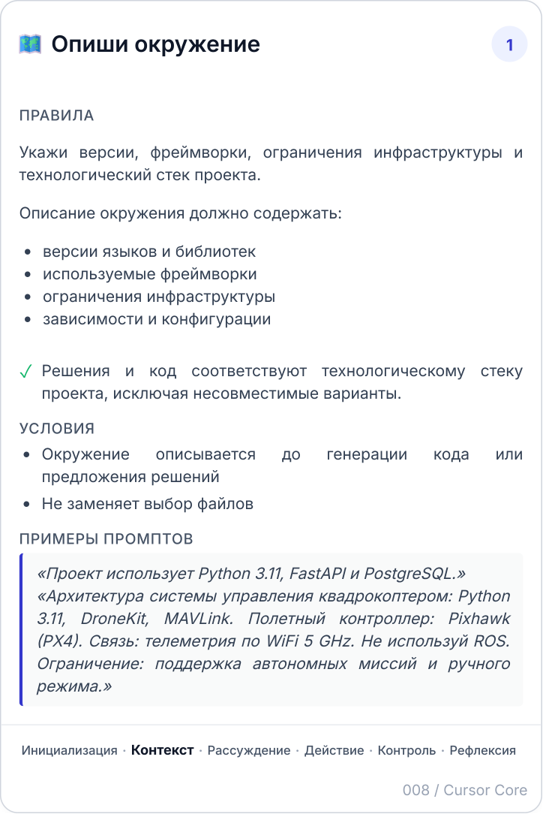</a><br>
      <strong><a href="cards-screenshots/card08-environment.pdf">08 - Укажи окружение</a></strong>
    </td>
    <td width="33%" valign="top">
      <a href="cards-screenshots/card09-stepwise-reasoning.pdf">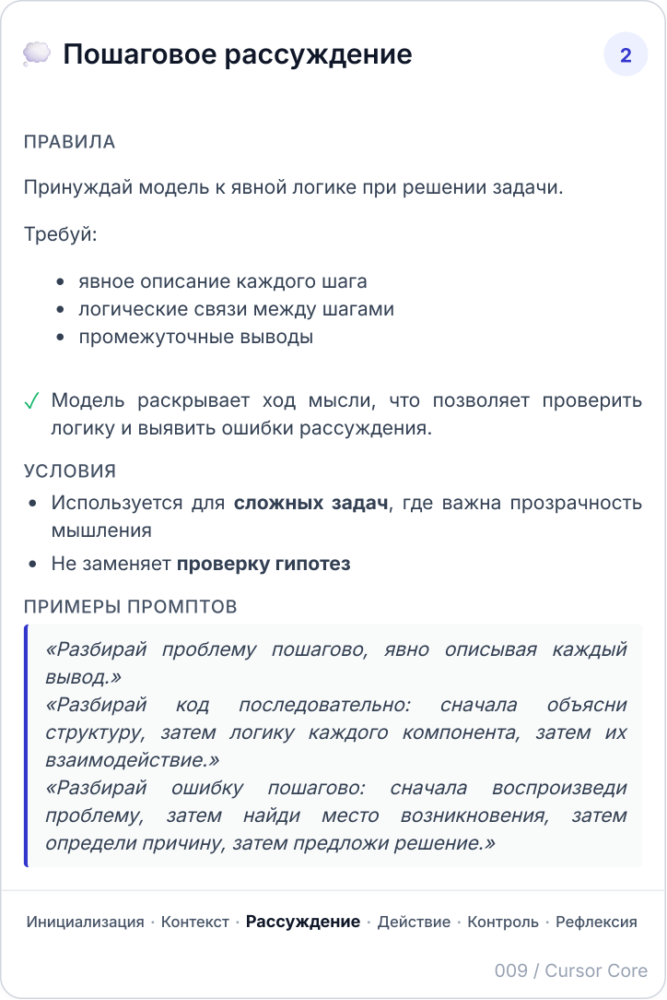</a><br>
      <strong><a href="cards-screenshots/card09-stepwise-reasoning.pdf">09 - Пошаговое рассуждение</a></strong>
    </td>
  </tr>
  <tr>
    <td width="33%" valign="top">
      <a href="cards-screenshots/card10-check-hypotheses.pdf"></a><br>
      <strong><a href="cards-screenshots/card10-check-hypotheses.pdf">10 - Проверь гипотезы</a></strong>
    </td>
    <td width="33%" valign="top">
      <a href="cards-screenshots/card11-compare-alternatives.pdf"></a><br>
      <strong><a href="cards-screenshots/card11-compare-alternatives.pdf">11 - Сравни альтернативы</a></strong>
    </td>
    <td width="33%" valign="top">
      <a href="cards-screenshots/card12-explain-assumptions.pdf"></a><br>
      <strong><a href="cards-screenshots/card12-explain-assumptions.pdf">12 - Объясняй допущения</a></strong>
    </td>
  </tr>
  <tr>
    <td width="33%" valign="top">
      <a href="cards-screenshots/card13-explain-code.pdf">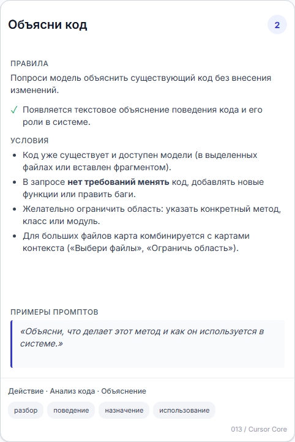</a><br>
      <strong><a href="cards-screenshots/card13-explain-code.pdf">13 - Объясни код</a></strong>
    </td>
    <td width="33%" valign="top">
      <a href="cards-screenshots/card14-find-problem.pdf"></a><br>
      <strong><a href="cards-screenshots/card14-find-problem.pdf">14 - Найди проблему</a></strong>
    </td>
    <td width="33%" valign="top">
      <a href="cards-screenshots/card15-suggest-solution.pdf"></a><br>
      <strong><a href="cards-screenshots/card15-suggest-solution.pdf">15 - Предложи решение</a></strong>
    </td>
  </tr>
  <tr>
    <td width="33%" valign="top">
      <a href="cards-screenshots/card16-write-code.pdf"></a><br>
      <strong><a href="cards-screenshots/card16-write-code.pdf">16 - Напиши код</a></strong>
    </td>
    <td width="33%" valign="top">
      <a href="cards-screenshots/card17-modify-code.pdf"></a><br>
      <strong><a href="cards-screenshots/card17-modify-code.pdf">17 - Измени код</a></strong>
    </td>
    <td width="33%" valign="top">
      <a href="cards-screenshots/card18-generate-tests.pdf"></a><br>
      <strong><a href="cards-screenshots/card18-generate-tests.pdf">18 - Сгенерируй тесты</a></strong>
    </td>
  </tr>
  <tr>
    <td width="33%" valign="top">
      <a href="cards-screenshots/card19-request-diff.pdf"></a><br>
      <strong><a href="cards-screenshots/card19-request-diff.pdf">19 - Запроси diff</a></strong>
    </td>
    <td width="33%" valign="top">
      <a href="cards-screenshots/card20-limit-changes.pdf"></a><br>
      <strong><a href="cards-screenshots/card20-limit-changes.pdf">20 - Ограничь изменения</a></strong>
    </td>
    <td width="33%" valign="top">
      <a href="cards-screenshots/card21-check-side-effects.pdf"></a><br>
      <strong><a href="cards-screenshots/card21-check-side-effects.pdf">21 - Проверь побочные эффекты</a></strong>
    </td>
  </tr>
  <tr>
    <td width="33%" valign="top">
      <a href="cards-screenshots/card22-forbid-guessing.pdf"></a><br>
      <strong><a href="cards-screenshots/card22-forbid-guessing.pdf">22 - Запрети угадывание</a></strong>
    </td>
    <td width="33%" valign="top">
      <a href="cards-screenshots/card23-self-check.pdf"></a><br>
      <strong><a href="cards-screenshots/card23-self-check.pdf">23 - Самопроверка</a></strong>
    </td>
    <td width="33%" valign="top">
      <a href="cards-screenshots/card24-assess-risks.pdf"></a><br>
      <strong><a href="cards-screenshots/card24-assess-risks.pdf">24 - Оцени риски</a></strong>
    </td>
  </tr>
  <tr>
    <td width="33%" valign="top">
      <a href="cards-screenshots/card25-suggest-next-step.pdf"></a><br>
      <strong><a href="cards-screenshots/card25-suggest-next-step.pdf">25 - Предложи следующий шаг</a></strong>
    </td>
    <td width="33%" valign="top">
      <a href="cards-screenshots/card26-summarize-result.pdf"></a><br>
      <strong><a href="cards-screenshots/card26-summarize-result.pdf">26 - Подведи итог</a></strong>
    </td>
    <td width="33%" valign="top">
    </td>
  </tr>
</table>
